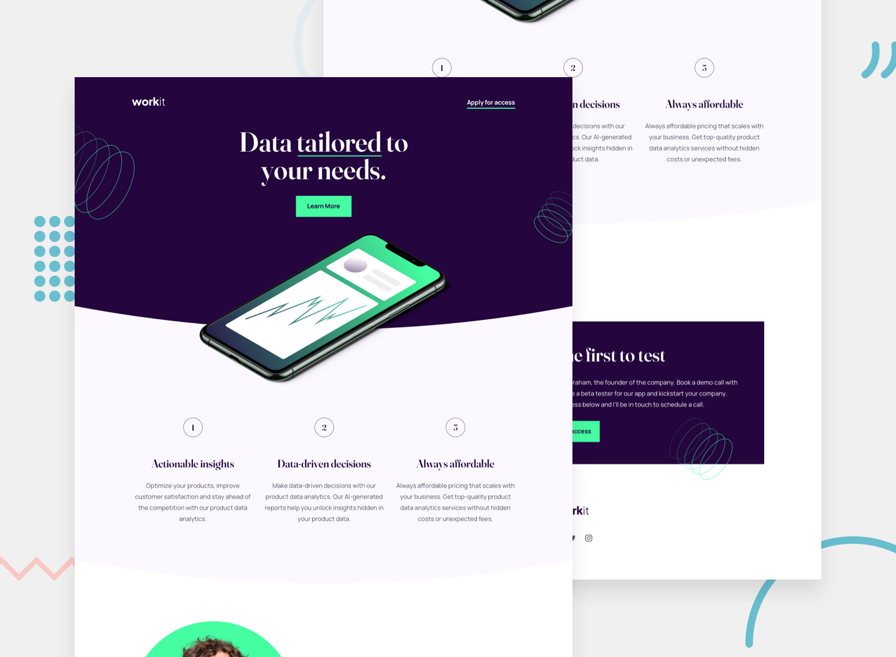

# Workit landing page - Frontend Mentor challenge

This landing page is a good exercise for work with proportions and elements positioning.

## Navigation

- [Overview](#overview)
  - [Screenshot](#screenshot)
  - [Main task](#main-task)
  - [Built With](#built-with)
  
- [Conclusions](#сonclusions)
  - [What have I achieved](#what-have-i-achieved)
- [More about me](#more-about-me)

## Overview

### Screenshot

### Main task

Your challenge is to build out this landing page and get it looking as close to the design as possible.

You can use any tools you like to help you complete the challenge. So if you've got something you'd like to practice, feel free to give it a go.

Your users should be able to:

- View the optimal layout depending on their device's screen size
- See hover states for interactive elements

### Built With

- HTML5 mark-up
- CSS3 styles
- Flexbox
- Grid

## Conclusions

This task was quite interesting and moderately easy. Placing objects according to the proportions on the layout, a little work with pseudo-elements and auto-calculation, changing the layout at different screen resolutions - the main challenges, but quite simple to work with. The main task, as always, was to write clean, convenient and scalable code

In the work, I adhered to the separation of styles into different files for each section. Next time I would involve the use of Vite and the ability to separate the html code also by sections with a link to them in the main file for better code structuring.

### What have I achieved

I can find errors and bugs much faster and find solutions to them quickly. Building a combined layout with alternating flexbox and grid depending on the screen resolution and the location of elements on the layout is an easy and natural task that does not cause confusion.

## More about me

You can find my personal website with a portfolio of my work at the link https://solvixcode.com/

- GitHub https://github.com/Olha-Fursova
- LinkedIn https://www.linkedin.com/in/olha-fursova-6727b7265/
- Frontend Mentor https://www.frontendmentor.io/profile/Olha-Fursova
- Twitch https://www.twitch.tv/solvixcode/